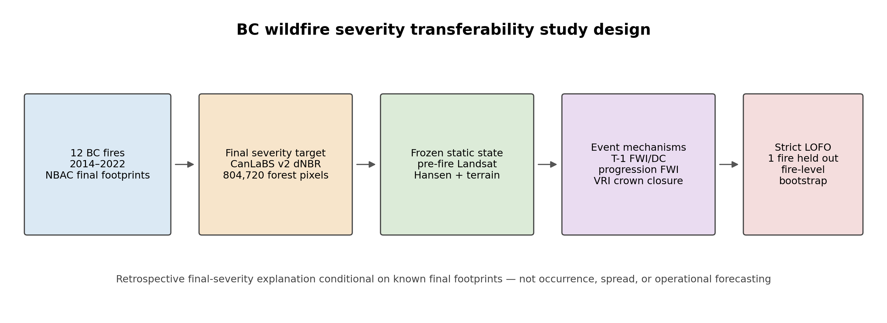
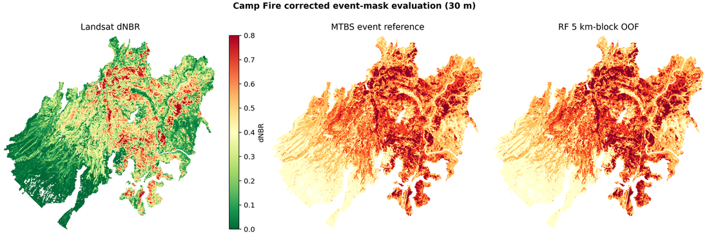
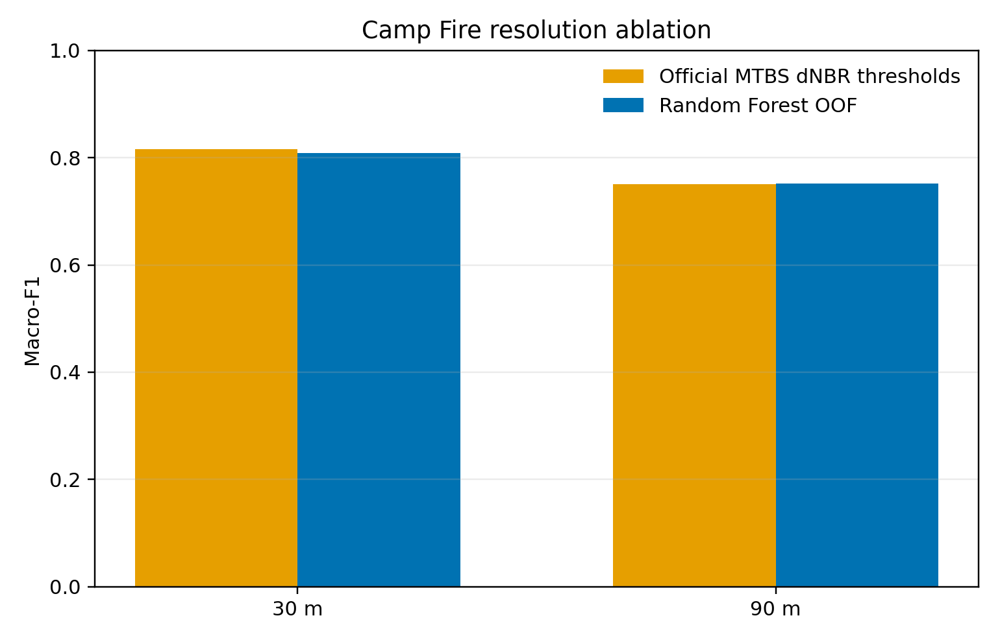
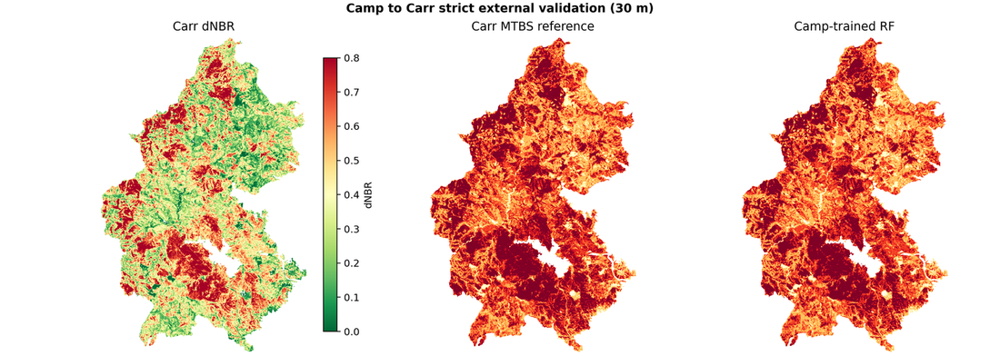
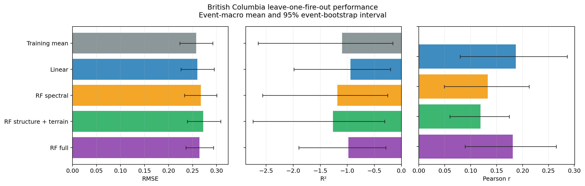
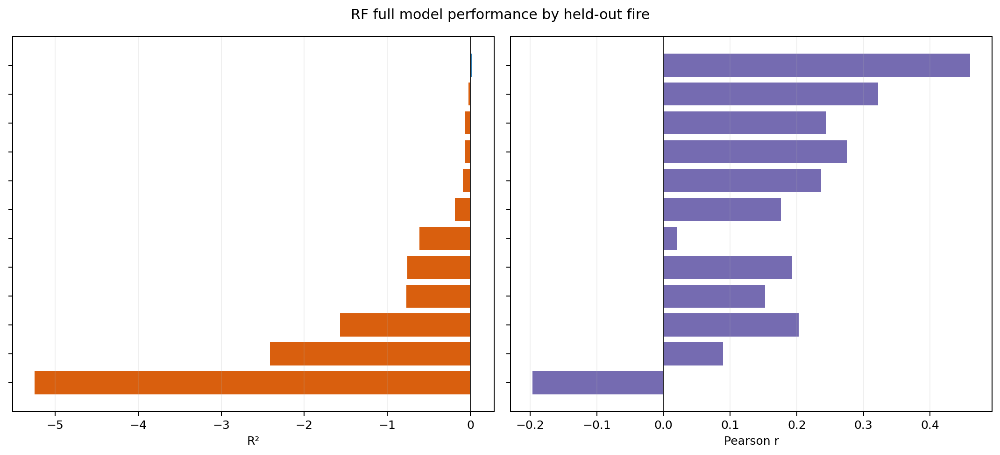
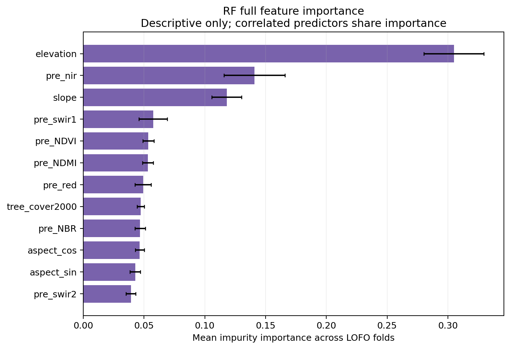
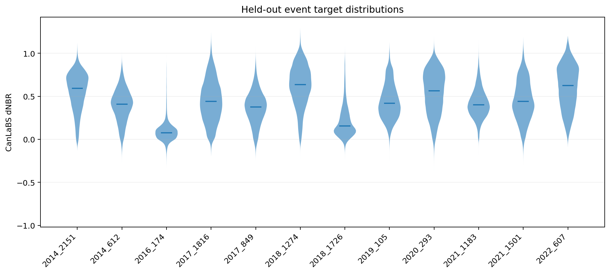

# Cross-Event Wildfire Severity Modeling with Remote Sensing

Random Forest burn-severity models tested on three increasingly hard
generalization problems: within-event spatial cross-validation (Camp Fire),
strict cross-event transfer (Camp → Carr), and prospective pre-fire prediction
(12 British Columbia fires, leave-one-fire-out).



## Headline results

| Experiment | Model | Macro-F1 | Balanced acc. |
|---|---|---|---|
| Camp internal CV, 30 m | Random Forest (5 km-block OOF) | 0.809 | 0.822 |
| Camp internal CV, 30 m | Official MTBS dNBR thresholds | 0.816 | 0.820 |
| Camp → Carr (untouched) | Camp-trained Random Forest | **0.798** | **0.796** |
| Camp → Carr (untouched) | Camp-frozen dNBR thresholds | 0.789 | 0.775 |
| Camp → Carr (reference only) | Carr official dNBR thresholds | 0.793 | — |

- Inside Camp Fire at 30 m, the official dNBR rule scores **above** the Random
  Forest (0.816 vs 0.809); at 90 m they converge (0.752 vs 0.750). dNBR
  thresholding is designed for within-event mapping.
- Camp → Carr, the Random Forest retains **98.6 %** of its Camp out-of-fold
  Macro-F1 with zero Carr tuning. Its advantage is small in Macro-F1 (0.798 vs
  0.789) and larger in balanced accuracy (0.796 vs 0.775) and high-severity
  recall (0.809 vs 0.765).
- British Columbia: every model has **negative event-macro R²** (RF full −0.98;
  linear −0.94; naive −1.10) and none beats the naive training mean on absolute
  dNBR. A weak rank signal survives (Pearson r ≈ 0.18, top-quartile F1 ≈ 0.35).

## Why the three experiments are not the same task

| | United States (stages 1-2) | British Columbia (stage 3) |
|---|---|---|
| Task | Retrospective severity **mapping** | Prospective severity **modeling** |
| Inputs | pre + post Landsat response | pre-fire Landsat + structure + terrain |
| Reference | MTBS 4-class severity (thematic) | CanLaBS v2 continuous dNBR (spectral) |
| Validation | 5 km block CV; whole-event transfer | Leave-one-fire-out (12 events) |
| Post-fire terms | used as features | **forbidden** (enforced in code) |

The 0.80-level F1 in the USA and the negative R² in BC answer different
questions. The USA tests spatial and cross-event generalization of a mapping
model; BC tests whether severity can be predicted from the pre-fire landscape
alone. The BC experiment does **not** predict fire occurrence or future fire
extent — it predicts subsequent dNBR within the perimeters of held-out fires.

## Experiment 1 — Camp Fire spatial CV

The 2018 Camp Fire (MTBS `CA3982012144020181108`), its exact MTBS pre/post
Landsat scenes, and a 13-band stack (pre/post indices, dNBR-family differences,
post-fire reflectance) are classified into MTBS severity classes 1-4. Five-fold
cross-validation splits on **5 km spatial blocks** (no spatial neighbor crosses
the fold boundary); training is class-balanced (≤ 25,000 px/class/fold); every
valid test-fold pixel is scored. 684,537 valid pixels at 30 m.





Full metrics: `experiments/usa_camp_carr/results/metrics_30m.json`, `metrics_90m.json`.

## Experiment 2 — Camp → Carr external transfer

The Camp-trained Random Forest is applied **unchanged** to the complete 2018
Carr Fire (`CA4065012263020180723`, 1,032,984 valid pixels). Baselines share the
same constraint: dNBR thresholds frozen from Camp's own MTBS event
(`[0.060, 0.301, 0.570]`), and Carr's own official thresholds reported as
**reference only** (a rule calibrated on the test event is not external).

| Method (all external except reference) | Macro-F1 | Balanced acc. | High-sev. recall |
|---|---|---|---|
| Camp-trained RF | **0.798** | **0.796** | **0.809** |
| Camp-frozen dNBR | 0.789 | 0.775 | 0.765 |
| Carr official thresholds (reference) | 0.793 | — | — |

Performance retention vs Camp OOF: 0.986. All methods sit in a narrow band; the
Random Forest's clearest advantage is balanced accuracy and high-severity recall.



Full metrics and per-feature distribution shift:
`experiments/usa_camp_carr/results/camp_to_carr_metrics.json`.

## Experiment 3 — British Columbia pre-fire LOFO

12 fires (2014-2022, NBAC) with CanLaBS v2 dNBR as target and **pre-fire
predictors only**: up to three pre-season Landsat scenes (pixel-median
composite), Hansen 2000 tree cover minus pre-fire loss, Copernicus GLO-30
terrain. 821,214 forest pixels. `src/features/bc_table.py` and `run_lofo.py`
assert that no post-fire term is present.

Leave-one-fire-out: fit each fold on an equal 15,000-pixel quota per training
fire (proportional target-decile sampling), score every valid pixel of the
held-out fire, aggregate the 12 event scores with a 95 % event-bootstrap
interval (10,000 reps). The high-severity threshold is the *training* upper
quartile; RF hyper-parameters are fixed a priori.

| Model | Event-macro RMSE | Event-macro R² | Pearson r | Top-25 % F1 |
|---|---|---|---|---|
| Naive training mean | 0.257 | −1.10 | — | — |
| Linear (full) | 0.260 | −0.94 | 0.19 | 0.33 |
| RF spectral | 0.267 | −1.18 | 0.13 | 0.31 |
| RF structure + terrain | 0.272 | −1.27 | 0.12 | 0.32 |
| **RF full** | **0.264** | **−0.98** | **0.18** | **0.35** |

The best fire (2014_612) reaches R² 0.02; the worst (2016_174) is −5.25. The
negative result is the finding: it quantifies the cross-fire variance the
pre-fire landscape does not carry.









Metrics: `experiments/canada_bc/results/event_macro_summary_with_ci.csv`,
`event_pixel_metrics.csv`, `event_block_metrics.csv`.

## Repository structure and reproduction

```
configs/            YAML experiment definitions (scenes, blocks, RF hyper-parameters)
src/                data access, preprocessing, features, models, validation, visualization
experiments/        entry points and results for the USA and BC studies
figures/            the eight figures referenced in this README
reports/            detailed write-ups (camp_to_carr.md, bc_research_results.md)
docs/               methodology.md, data_sources.md, limitations.md
examples/           offline quick-start
```

```bash
pip install -r requirements.txt        # Python packages only
python examples/quickstart_metrics.py  # offline smoke test (no data needed)

# Stages 1-2 (needs Planetary Computer + MTBS access, and GDAL on PATH)
python experiments/usa_camp_carr/run_ablation.py --resolutions 30 90
python experiments/usa_camp_carr/run_transfer.py

# Stage 3 (needs NBAC workbook + shapefiles, CanLaBS, and GDAL on PATH)
python experiments/canada_bc/pipeline.py catalog --workbook <NBAC.xlsx> --output-dir <events_root>
python experiments/canada_bc/pipeline.py screen   --catalog <events_root>/bc_candidate_catalog.parquet --annual-dir <nbac_shp> --output-dir <events_root>
python experiments/canada_bc/pipeline.py features --screen-catalog <events_root>/batch_screen_catalog.parquet --candidate-catalog <events_root>/bc_candidate_catalog.parquet --events-dir <events_root>/events --output-dir <events_root>
python experiments/canada_bc/pipeline.py table    --catalog <events_root>/bc_event_catalog.parquet --events-dir <events_root>/events --output-dir <events_root>/feature_table
python experiments/canada_bc/run_lofo.py --table <events_root>/feature_table/bc_prefire_feature_table.parquet --output-dir <results>/lofo
python experiments/canada_bc/summarize_lofo.py --model-dir <results>/lofo --output-dir <results>/analysis
python experiments/canada_bc/plot_results.py --analysis-dir <results>/analysis --model-dir <results>/lofo --table <events_root>/feature_table/bc_prefire_feature_table.parquet --events-dir <events_root>/events --output-dir figures/canada
```

The GDAL command-line utilities (`gdalwarp`, `ogr2ogr`, `gdal_rasterize`) are an
external requirement, not Python packages: install them (conda, OSGeo4W/QGIS,
system GDAL) and make them discoverable via `PATH` or `GDAL_BIN_DIR` (see
`src/gdal_tools.py`). No raw raster, pixel table, or model binary is committed;
scene and collection identifiers are frozen in `configs/`.

## Data

| Product | Role | Provider / access |
|---|---|---|
| Landsat Collection 2 Level-2 | surface reflectance (QA-masked) | USGS via Planetary Computer |
| MTBS | 4-class severity + event thresholds | USGS / USDA FS |
| NBAC | Canadian event catalogue + perimeters | NRCan / Canadian Forest Service |
| CanLaBS v2 | continuous dNBR target (Canada) | NRCan national COG |
| Hansen GFC v1.11 | treecover2000 / lossyear | U. Maryland (Google Storage) |
| Copernicus GLO-30 | elevation, slope, aspect | ESA via Planetary Computer |

Version identifiers and redistribution notes:
[docs/data_sources.md](docs/data_sources.md).

## Limitations

- USA: two 2018 California fires, same Landsat family; MTBS is a thematic
  product, not field mortality.
- BC: 12 events in one province; Hansen treecover2000 is a historical proxy; no
  fire weather, fuel moisture, or fire-progression inputs; CanLaBS dNBR is a
  spectral target; negative event-macro R² bounds any absolute predictive claim.

Full discussion: [docs/limitations.md](docs/limitations.md).

## License

MIT — see [LICENSE](LICENSE).
